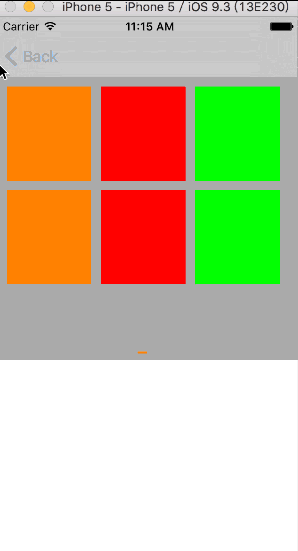

# BASudokuView
####这是个九宫格布局视图，如下:



####支持三种布局模式：
1. 左右按页滚动，并支持页面重用
2. 上下滚动
3. 左右滚动
####创建视图并设置代理和布局模式
```objc
- (void)viewDidLoad
{
    [super viewDidLoad];
    self.edgesForExtendedLayout = UIRectEdgeNone;
    self.sudokuView.delegate = self;
    self.sudokuView.dataSource = self;
    self.sudokuView.pageMode = self.pageMode;
    self.sudokuView.accessMode = self.accessMode;
    
    [self.view addSubview:self.sudokuView];
    
	// Do any additional setup after loading the view.
}

```

####在回调代理里可以设置每个格子的宽度和高度以及它们之间的间距，左边距、右边剧、上边距、下边距以及pageControl的样式等

```objc
//设置格子的个数
-(NSInteger)numberOfGridViewInSudokuView:(BASudokuView *)sudokuView
{
    return 9;
    
}
//设置最大列数
-(NSInteger)numberOfMaxColumnInSudokuView:(BASudokuView *)sudokuView
{
    if (self.pageMode == BASudokuViewPageModeHorizontalNoPaging) {
        return 5;
    }
    return 3;
}
//设置最大行数
-(NSInteger)numberOfMaxRowsInSudokuView:(BASudokuView *)sudokuView
{
    if (self.pageMode == BASudokuViewPageModeVertical) {
        return 3;
    }
    return 2;
}
//设置左边距
-(CGFloat)leftMarginOfGrid:(BASudokuView *)sudokuView
{
    return 10.0;
}
//设置上边距
-(CGFloat)topMarginOfGrid:(BASudokuView *)sudokuView
{
    return 10.0;
}
//设置下边距
-(CGFloat)bottomMarginOfGrid:(BASudokuView *)sudokuView
{
    return 10.0;
}
//设置右边距
-(CGFloat)rightMarginOfGrid:(BASudokuView *)sudokuView
{
    return 10.0;
}
//设置横向间距
-(CGFloat)horizontalSpacingBetweenGrid:(BASudokuView *)sudokuView
{
    return 10.0;
}
//设置纵向间距
-(CGFloat)verticalSpacingBetweenGrid:(BASudokuView *)sudokuView
{
    return 10.0;
}
//设置格子宽度
-(CGFloat)sudokuView:(BASudokuView *)sudokuView widthForGridAtIndexPath:(BAIndexPath)indexPath
{
     return 90;
}
//设置格子高度
-(CGFloat)sudokuView:(BASudokuView *)sudokuView heightForGridAtIndexPath:(BAIndexPath)indexPath
{
    return 100;
}
//设置pageControl的样式，只适用于第一种布局模式
-(PageControlStyle)sudokuView:(BASudokuView *)sudokuView styleOfPageControl:(StyledPageControl *)pageControl
{
    pageControl.gapWidth = 1;
    pageControl.squareSize = CGSizeMake(10, 2);
    pageControl._strokeWidth = 0;
    
    return PageControlStyleSquare;
}

-(UIColor *)sudokuView:(BASudokuView *)sudokuView normalColorInPageControl:(StyledPageControl *)pageControl
{
    return [UIColor blueColor];
}
-(UIColor *)sudokuView:(BASudokuView *)sudokuView selectedColorInPageControl:(StyledPageControl *)pageControl
{
    return [UIColor orangeColor];
}

//创建每个格子视图gridView
-(UIView *)sudokuView:(BASudokuView *)sudokuView gridViewAtPath:(BAIndexPath)indexPath
{
    NSInteger index = BAIndex(indexPath, self, sudokuView);
    UIView *gridView =[[UIView alloc]init];
    
    if (index % 3 == 0) {
        gridView.backgroundColor = [UIColor orangeColor];
    } else if (index % 3 == 1) {
        gridView.backgroundColor = [UIColor redColor];
    } else  {
        gridView.backgroundColor = [UIColor greenColor];
    }
    return gridView;
}

//每个格子点击事件
-(void)sudokuView:(BASudokuView *)sudokuView didSelectGridAtIndexPath:(BAIndexPath)indexPath
{
    
    NSInteger row = indexPath.row;
    NSInteger column = indexPath.column;
    NSInteger page = indexPath.page;
    
    NSLog(@"row:%li,column:%li,page:%li", (long)row, (long)column, (long)page);
}

```
####详细代码请下载demo

